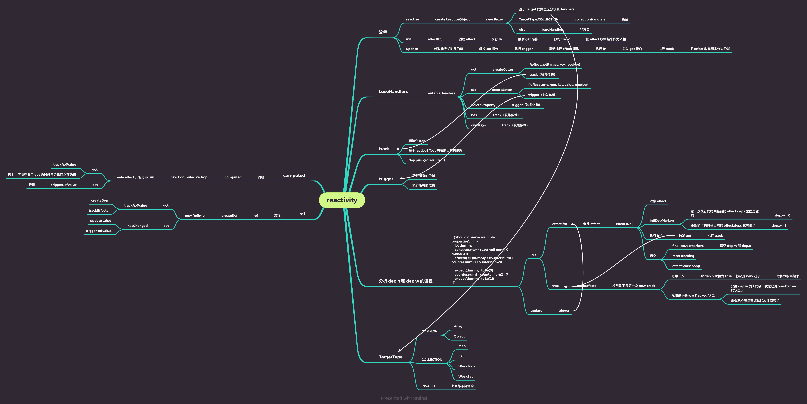

# 1、vue3源码结构解析


- **1、sfc单文件通过下面的dom和core去解析成render函数**
- **2、runtime-dom里引用了runtime-core，runtime-core里引用了reactivity**

# 2、setup 环境：集成 jest & ts

```js
npm install -g yarn
yarn int -y
yarn add typescript --dev
npx tsc --init
yarn add jest @types/jest --dev

配置tsconfig.json
"types": ["jest"],"noImplicitAny": false, "lib": ["DOM","ES6"],  
    
配置jest可以使用modules导入
yarn add --dev babel-jest @babel/core @babel/preset-env
yarn add --dev @babel/preset-typescript

babel.config.js
module.exports = {
  presets: [
    ['@babel/preset-env', {targets: {node: 'current'}}],
    '@babel/preset-typescript',
  ],
};
```

# 3、实现reactive函数及周边函数



```js
// 元组信息判断是否是IS_REACTIVE还是IS_READONLY
export const enum ReactiveFlags {
  IS_REACTIVE = '__v_isReactive',
  IS_READONLY = '__v_isReadonly'
}
//抽离代码
function createReactiveObject(obj, baseHandles) {
  if (!isObject(obj)) {
    console.warn(`target ${obj} 必须是一个对象`)
    return obj
  }
  const proxy = new Proxy(obj, baseHandles)
  return proxy
}
// reactive
export function reactive(obj) {
  return createReactiveObject(obj, mutableHandlers)
}
// readonly
export function readonly(obj) {
  return createReactiveObject(obj, readonlyHandlers)
}
// shallowReadonly
export function shallowReadonly(obj) {
  return createReactiveObject(obj,shallowReadonlyHandlers)
}

export function isReactive(obj) {
  return !!obj[ReactiveFlags.IS_REACTIVE]
}

export function isProxy(obj) {
  return isReactive(obj) || isReadonly(obj)
}

export function isReadonly(obj) {
  return !!obj[ReactiveFlags.IS_READONLY]
}

// createReactiveObject的代码
const get = createGetter()
const set = createSetter()
const readonlyGet = createGetter(true)
const shallowReadonlyGet = createGetter(true, true)
function createGetter(isReadonly = false, isShallow = false) {
  return function get(target, key) {
    if (key === ReactiveFlags.IS_REACTIVE) {
      return !isReadonly
    } else if (key === ReactiveFlags.IS_READONLY) {
      return isReadonly
    }
    const res = Reflect.get(target, key)
    if(isShallow){
      return res
    }
    //判断属性是否是一个对象
    if (isObject(res)) {
      return isReadonly ? readonly(res) : reactive(res)
    }
    // TODO:收集依赖
    if (!isReadonly) {
      track(target, key);
    }
    return res
  }
}
function createSetter() {
  return function set(target, key, value) {
    const res = Reflect.set(target, key, value)
    // TODO:触发依赖
    trigger(target, key)
    return res
  }
}

export const mutableHandlers = {
  get,
  set
}

export const readonlyHandlers = {
  get: readonlyGet,
  set(target, key) {
    console.warn(
      `key :"${String(key)}" set 失败，因为 target 是 readonly 类型`,
      target
    );
    return true
  }
}

export const shallowReadonlyHandlers = extend({}, readonlyHandlers, {
  get: shallowReadonlyGet
})

```

# 4、实现effect依赖收集系统

````js
1、创建ReactiveEffect的class
// 用于依赖收集
export class ReactiveEffect {
  public _fn: any
  public scheduler: Function | undefined
  onStop?: () => void;
  deps = []
  StopActive = true
  constructor(fn, scheduler?) {
    this._fn = fn
    this.scheduler = scheduler
  }
  run() {
    if (!this.StopActive) {
      return this._fn()
    }
    // 应该收集
    shouldTrack = true
    activeEffect = this
    const result = this._fn()
    //重置
    shouldTrack = false
    return result

  }
  stop() {
    if (this.StopActive) {
      cleanupEffect(this)
      if (this.onStop) {
        this.onStop()
      }
      this.StopActive = false
    }
  }
}
//  优化代码
export function cleanupEffect(effect) {
  effect.deps.forEach((dep: any) => {
    dep.delete(effect)
  })
}

2、实现依赖收集
export function track(target, key) {
  if (!isTracking()) return
  let depMaps = targetMap.get(target)
  if (!depMaps) {
    depMaps = new Map()
    targetMap.set(target, depMaps)
  }
  let dep = depMaps.get(key)
  if (!dep) {
    dep = new Set()
    depMaps.set(key, dep)
  }
  trackEffects(dep)
}
export function trackEffects(dep) {
  //判断是否存在
  if (!dep.has(activeEffect)) {
    dep.add(activeEffect)
    activeEffect.deps.push(dep)
  }
}
// 判断是否需要收集依赖
export function isTracking() {
  return shouldTrack && activeEffect !== undefined
}

3、触发依赖
export function trigger(target, key) {
  let depMaps = targetMap.get(target)
  let dep = depMaps.get(key)
  triggerEffects(dep)
}

export function triggerEffects(dep) {
  for (const effect of dep) {
    if (effect.scheduler) {
      effect.scheduler()
    } else {
      effect.run()
    }
  }
}
4、实现effect
// entend相当于Obejct.assign()
export function effect(fn, options = {}) { 
  const _effect = new ReactiveEffect(fn);
  extend(_effect, options)
  _effect.run()
  const runner: any = _effect.run.bind(_effect)
  runner.effect = _effect
  return runner
}

5、实现effect的stop功能

export function stop(runner) {
  runner.effect.stop();
}
````

# 5、实现ref函数及周边函数


```js
// 定义RefImpl的class，利用class的静态方法get和set方法
export class RefImpl {
  public _value: any
  public dep
  public _rawValue: any
  public __v_isRef = true
  constructor(value) {
    this._value = convert(value)
    this._rawValue = value
    this.dep = new Set()
  }
  get value() {
    trackRefValue(this)
    return this._value
  }
  set value(newValue) {
    if (hasChanged(this._rawValue, newValue)) {
      this._rawValue = newValue
      this._value = convert(newValue)
      triggerEffects(this.dep)
    }
  }
}
function convert(value) {
  return isObject(value) ? reactive(value) : value
}
function trackRefValue(ref) {
  if (isTracking()) {
    trackEffects(ref.dep)
  }
}
export function ref(value) {
  return new RefImpl(value)
}
export function isRef(value) {
  return !!value.__v_isRef
}
//如果参数是 ref，则返回内部值，否则返回参数本身
export function unRef(ref) {
  return isRef(ref) ? ref.value : ref
}
// 如果 set 的值是非响应式，就是替换；如果是响应式，就是重新赋值
export function proxyRefs(objectWithRefs) {
  return new Proxy(objectWithRefs, {
    get(target, key, receiver) {
      return unRef(Reflect.get(target, key, receiver))
    },
    set(target, key, newValue, receiver) {
      if (!isRef(newValue) && isRef(target[key])) {
        return (target[key].value = newValue)
      } else {
        return Reflect.set(target, key, newValue, receiver)
      }
    },
  })
}

```

# 6、实现computed函数

````js
// 利用依赖收集系统的第二个参数，实现缓存效果
class ComputedRefImpl {
  public _getter: any;
  public _value: any;
  public _effect: any;
  public _dirty: Boolean = true;
  constructor(getter) {
    this._getter = getter;
    this._effect = new ReactiveEffect(getter,()=>{
      if(!this._dirty){
        this._dirty = true;
      }
    })
  }
  get value() {
    if (this._dirty) {
      this._dirty =false
      this._value= this._effect.run()
    }
    return  this._value
  }
}

export function computed(fn) {
  return new ComputedRefImpl(fn)
}
````

# 7、实现rollup打包库

## 1、安装插件并创建rollup.config.js文件

```js
//配置rollup打包库
yarn add rollup --dev
//插件
yarn add @rollup/plugin-typescript --dev
yarn add tslib --dev

import typescript from '@rollup/plugin-typescript'
import pkg from './package.json'
export default {
  input: "./src/index.ts",
  output: [
    //cjs ->commonjs
    // es->esm
    {
      format: "cjs",
      file:pkg.main,
    },
    {
      format: "es",
      file: pkg.module,
    },
  ],
  plugins:[
    typescript()
  ]
};


```

## 2、配置tsconfig.json和packge.json


# 8、实现初始化componenet主流程


````js
1、app.js
import { h } from "../../lib/mini-vue.esm.js";
export const App = {
  render() {
    return h("div", "hi mini-vue" + this.msg);
  },
  setup() {
    return {
      msg: "mini-vue",
    };
  },
};
2、main.js
import { App } from "./App.js";
import { createApp } from "../../lib/mini-vue.esm.js";
const rootContainer = document.querySelector("#app");
createApp(App).mount(rootContainer);

3、createApp的实现并创建虚拟节点

export function createApp(rootComponent) {
  return {
    mount(rootContainer) {
      //先转化成vnode
      // component -> vnode
      // 所有的逻辑操作都会基于vnode处理
      const vnode = createVnode(rootComponent)
      render(vnode, rootContainer)
    }
  }
}

4、createVnode方法创建虚拟节点

export function createVnode(type,props?,children?){
  const vnode = {
    type,
    props,
    children
  }
  return vnode
}

5、实现render函数


````


# 9、实现初始化element主流程


9、

```
diff算法

1、左侧对比
2、右侧对比
3、新的比老的多 删除新的
4、老的比新的多 删除老的
5、中间对比---{
    	先进行双端对比；
    	创建新的（d)(在老的里面不存在，新的里面存在）
		删除老的（y)(在老的里面存在，新的里面不存在）
		移动（c、e)(节点存在于新的和老的里面，但是位置变了）
}
```

